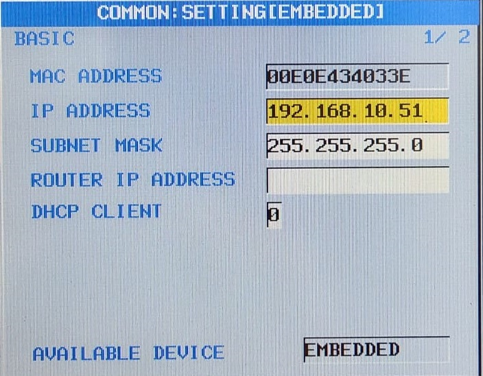
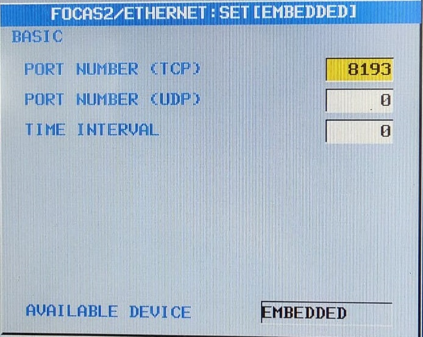
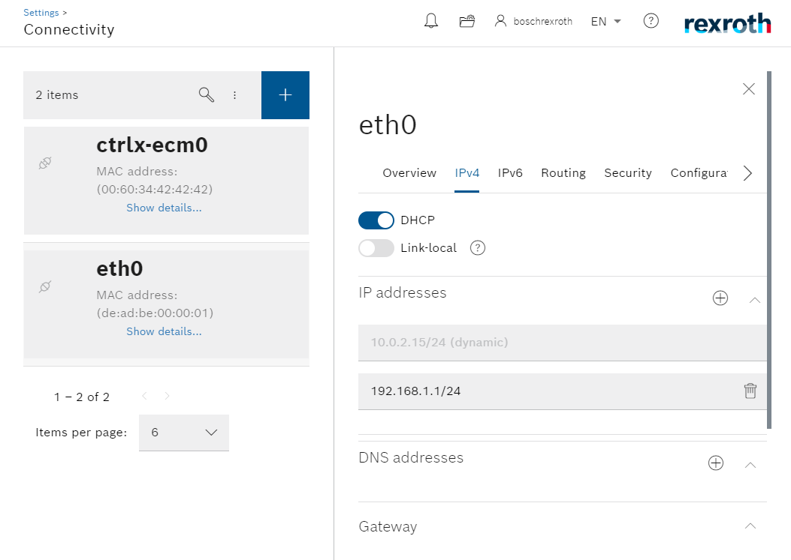
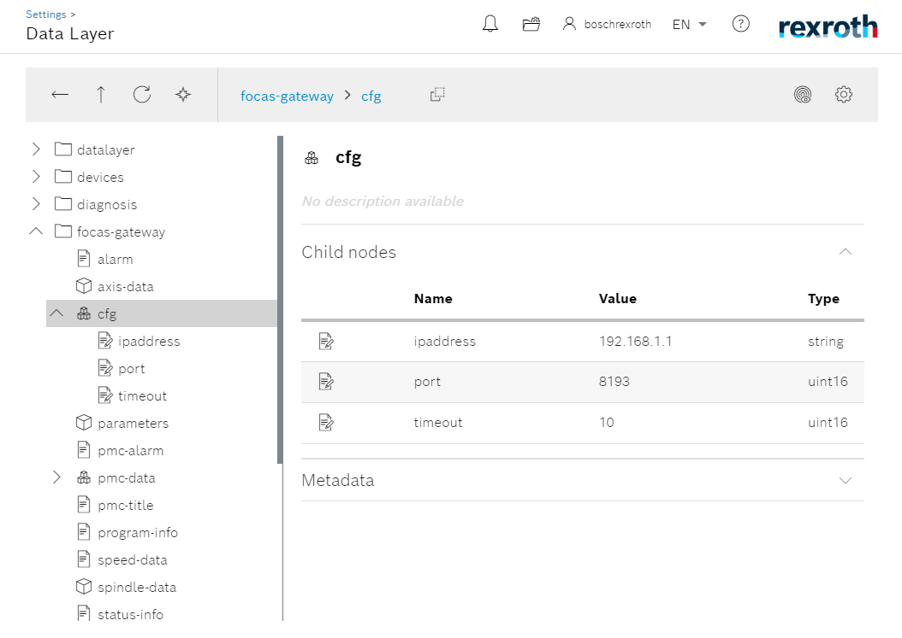
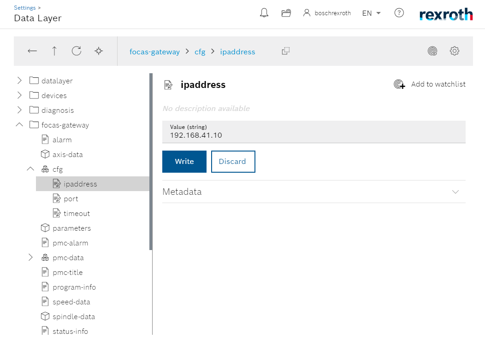

Configuration
============

.. _configurations:

Network Configuration
----------------------------

Use the following topology as an example.

.. image:: imgs/configure/1-network-topology.png
  :width: 600
  :alt: Network Topology

Initially, the user must know the network configurations of the FANUC controller. Theses configurations can be checked in the following screens of the controller. Note down the IP address and the FOCAS 2 protocol port of the FANUC controller, we will use it soon.

In this example, the FANUC controller has the following configurations:
  - IP Address:     *192.168.10.51*
  - Port number:    *8193*

The *ctrlX CORE* has two network interfaces, ``eth0`` and ``eth1``. In this example, ``eth0`` is physically connected to superior instances e.g. a local network, a server or to the internet, and the ``eth1`` is physically connected to a FANUC controller. The network configuration of the *ctrlX CORE* has to reflect this topology. This means that the ``eth1`` interface must be at the same subnet as the FANUC controller, as only by this they can see each other.

For that, we need to modify the ``eth1`` interface assigning the respective IP address, in this example ``192.168.10.1``.

Now both devices are in the same network, but we still have additional configuration to do, at this time in the *FOCAS 2 Gateway* *ctrlX Datalayer* node `focas-gateway > cfg`.

In order to change the configuration, select a node, write the new value and click on `write` to apply the modifications.

In the next section, we will cover all the different data that can be collected using the *FOCAS 2 Gateway App* :ref:`acquire`.
