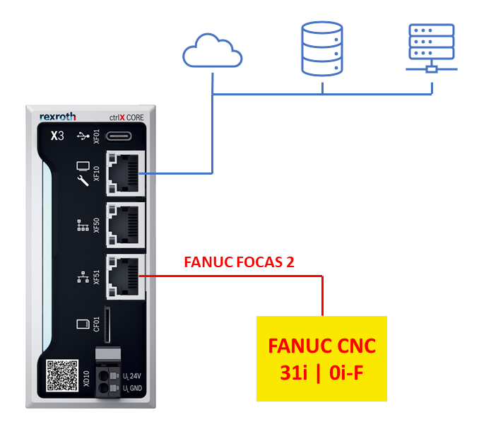

Configuração
============

.. _configurações:

Configurações de Comunicação
----------------------------
Considere como um exemplo a topologia abaixo:

Inicialmente, deve-se ter conhecimento das configurações do comando CNC Fanuc. Para isso, acesse as telas abaixo no comando para ter conhecimento do endereço ip e a porta do protocolo FOCAS 2.

Nesse exemplo, sabe-se que o comando CNC Fanuc tem o endereço IP ``192.168.10.51`` e o protocolo FOCAS 2 está usando a porta ``8193``.
  
Como indicado na topologia, o ctrlX CORE possui duas interfaces de rede ``eth0`` e ``eth1``. Nesse exemplo, a porta ``eth0`` está conectado a sistemas superiores, uma rede local ou até mesmo na nuvem. E, a interface ``eth1`` está conectada a rede na qual está presente o comando CNC Fanuc. Obrigatóriamente, precisa-se configurar as interfaces de modo que elas estejam na mesma sub-rede da rede na qual estão conectadas.

Então, nesse exemplo, a interface ``eth1`` deve estar configurada com o endereço IP ``192.168.10.1`` que pertence a mesma sub-rede do comando CNC Fanuc.

Para isso, modifique as configurações das interfaces.

Agora que o ctrlX CORE está na mesma faixa de rede do comando CNC Fanuc, precisa-se configurar o endereço IP do comando nas configurações do app *FOCAS 2 Gateway* para que ele consiga realizar a aquisição de dados usando o protocolo FOCAS 2.

Dessa forma, a interface *ctrlX Datalayer* possibilita a modificação dessas configurações através do nó `focas-gatewya > cfg`.

Para alterar alguma configuração, clique na variável dentro do nó, escreva o novo valor e por fim, clique no botão `write` para salvar as modificações.

.. image:: imgs/configure/8-cfg-change-ipaddress.png
  :width: 600
  :alt: FOCAS 2 Gateway IP Address configuration

Na próxima seção, descreve-se todos os dados que podem ser aquisitados através do protocolo FOCAS 2. :ref:`aquisição`.
