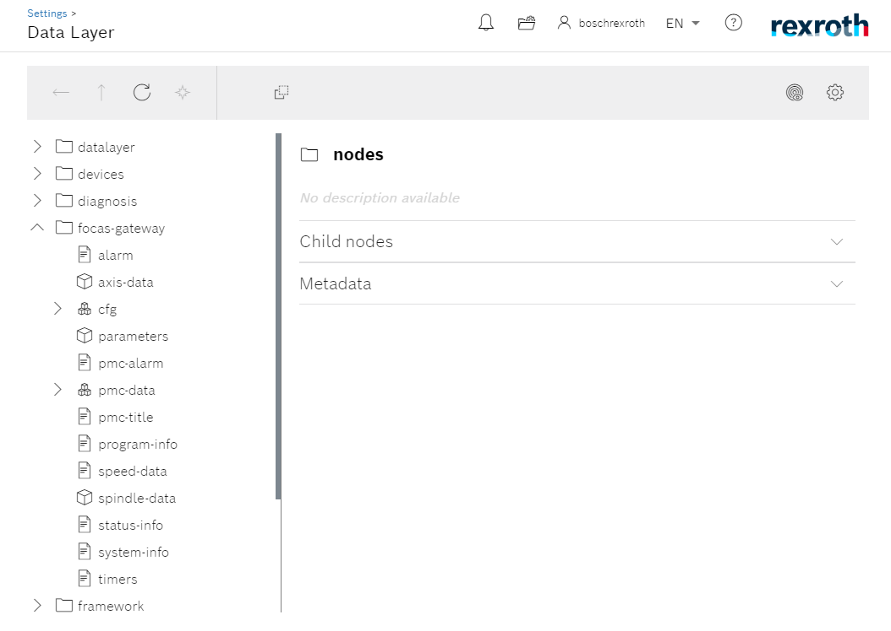

FOCAS 2 Gateway App
===============

**FOCAS 2 Gateway** is an third party app for the `ctrlX Automation <https://apps.boschrexroth.com/microsites/ctrlx-automation/en/>`_ plataform. It implements the FANUC FOCAS 2 protocol (only TCP/IP) that enables the extraction of data from *FANUC* numeric controllers from series 0i-F. Collected data is made available on the ``ctrlX Datalayer`` interface.

Please refer to the oficial *Bosch Rexroth* site for more information about the `ctrlX Automation <https://apps.boschrexroth.com/microsites/ctrlx-automation/en/>`_ plataform.

Disclaimer
________

This is an unofficial app for the ctrlX Automation plataform. If you're looking for official apps from *Bosch Rexroth* and *ctrlX World* partners, refer to the `ctrlX Store <https://developer.community.boschrexroth.com/t5/Store-and-How-to/bg-p/dcdev_community-dev-blog/label-name/rex_c_Store>`_.

Index
--------

.. toctree::

   install
   configure
   acquire
