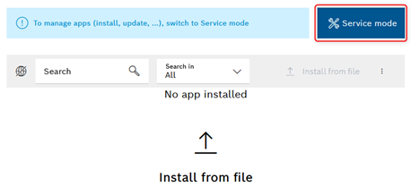
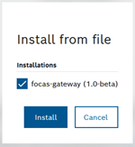
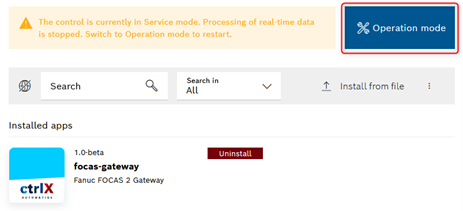
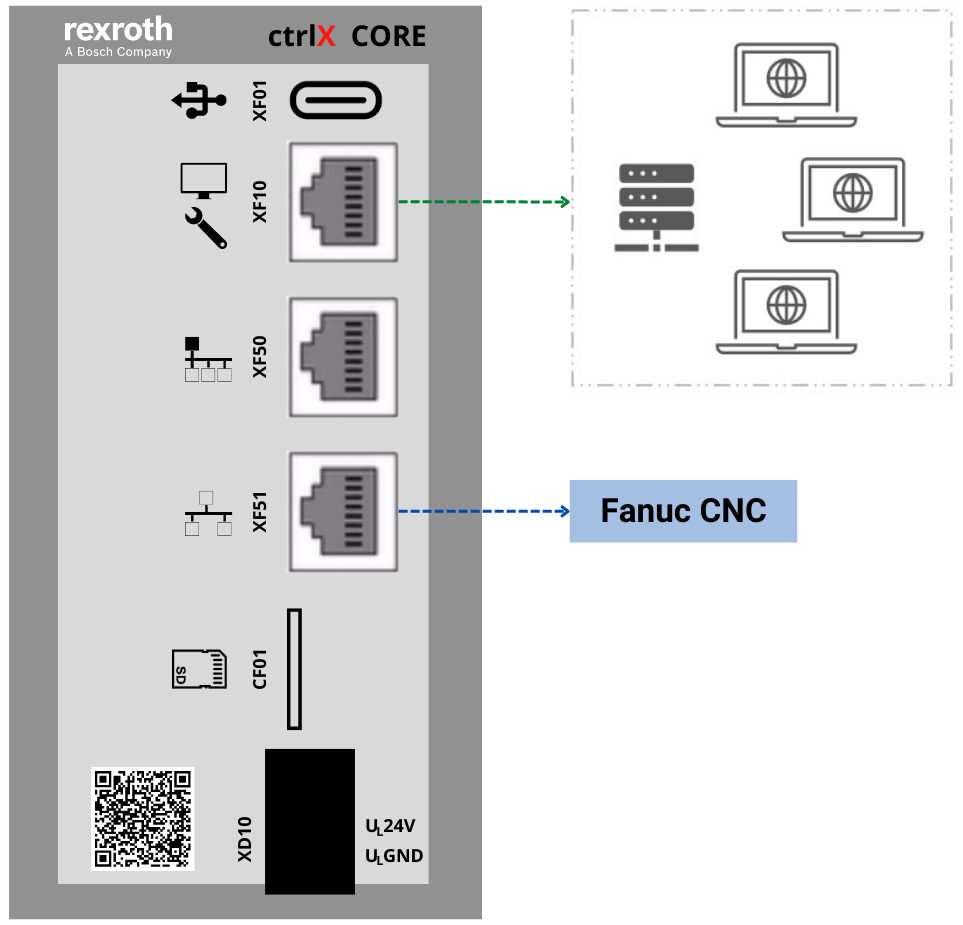

Instalação
==========

Os aplicativos da plataforma ctrlX Automation, podem ser disponibilizados em dois formatos ``.snap`` ou ``.app``. No caso de aplicativos no formato ``.snap``, tem-se dois arquivos distintos de instalação, cada um voltado a uma arquitetura específica, de acordo com a arquitetura do ctrlX Core (``amd64`` ou ``arm64``).

.. _arquiteturas:

Arquiteturas
------------

- ctrlX Core Virtual
O ctrlX Core Virtual é uma máquina virtual que simula todas as funcionalidades de um ctrlX Core na máquina do usuário. Nesse caso, tem-se a arquitetura ``amd64``, portanto o aplicativo a ser instalado deve ter um sufixo em seu nome identificando o suporte a essa arquitetura.

``focas-gateway_{versão}_amd64.snap``

- ctrlX Core
O ctrlX Core tem a arquitetura ``arm64``. Dessa forma, o aplicativo a ser instalado deve ter um sufixo em seu nome identificando o suporte a essa arquitetura.

``focas-gateway_{versão}_arm64.snap``

.. _instalação:

Procedimento
------------
Para habilitar a instalação de aplicativos, primeiro deve-se alterar para *Service Mode*.

Na sequência, enviar o arquivo ``.snap`` ou ``.app`` referente ao aplicativo a ser instalado. Para arquivos ``.snap``, verificar corretamente a arquitetura suportada. Se o arquivo de instalação foi enviado corretamente, a janela abaixo deve aparecer contendo o nome do aplicativo e a sua versão semântica.

Após a correta instalação do aplicativo, retornar para *Operation Mode*.

Na sequência, configurar corretamente o endereço da porta ethernet em rede com o comando Fanuc. Atentar-se em configurar a porta correta, ``eth0`` (XF10) ou ``eth1`` (XF51).

Em seguida, alterar no node ``focas-gateway > cfg`` os parâmetros de rede do comando Fanuc. Para referência, leia a seção :ref:`configurações`.