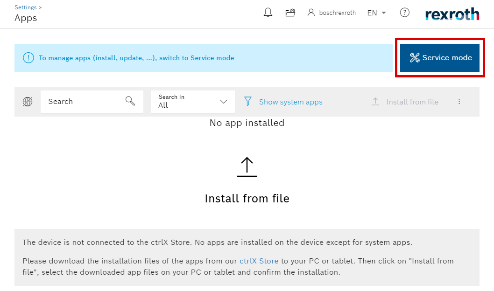
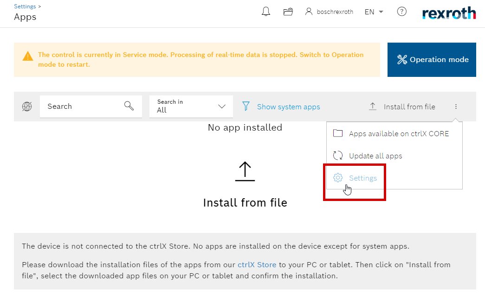
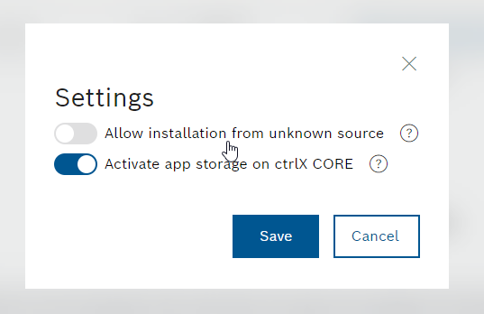
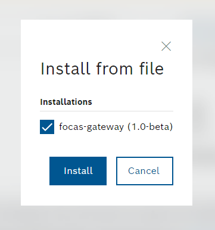
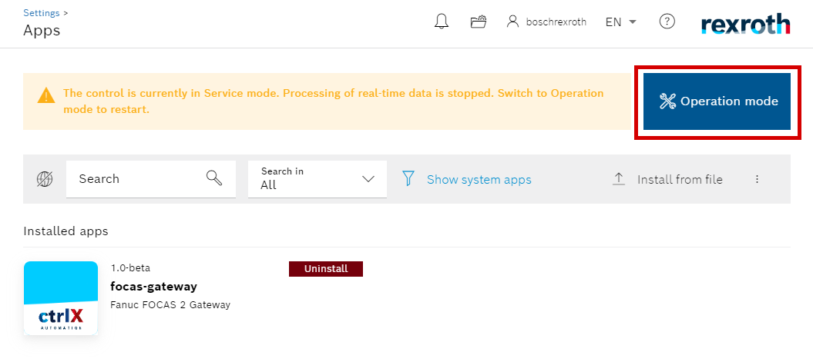

Installation
==========

The apps for the ``ctrlX Automation`` plataform are provided in two different formats, ``.snap``` or ``.app``. In this case we have the ``.snap`` format, so, because of that, we get two different app files that are aimed for specific architectures, ``arm64`` and ``amd64``. If you are unsure about which one you should use, this is related wheter you are using the *ctrlX CORE Virtual* ``amd64`` virtual machine or the *ctrlX CORE* ``arm64`` physical device.

.. _architectures:

Architectures
------------

ctrlX CORE Virtual
  The *ctrlX CORE Virtual* is a virtual machine that emmulates all the functionalities of a physical device. In this case, the user must use the ``amd64`` version which can be identified in the snap filename.

  ``focas-gateway_v*.*_amd64.snap``

ctrlX CORE
  The *ctrlX CORE* is the physical device which is based on the ``arm64`` achitecture. Similarly, the user must the ``arm64`` version which can be identified in the snap filename.

  ``focas-gateway_v*.*_arm64.snap``

.. _installation:

Procedure
------------
In some earlier *ctrlX CORE* versions the user must first switch to *Service Mode*.



Unofficial app support is disabled by default, so, before anything, we need to enable third party apps support. For this, click on the *settings* button.



And then *Allow installation from unknown sources*.



Now we are able to upload the ``.snap`` file. If the upload was successful, a box should popup with the app name. Proceed with the installation.



Now it is a good time to switch back to *Operation Mode*.



You have just installed the *FOCAS 2 Gateway App*.

In the next section, we will cover the configuration steps for further communication with the FANUC controller. :ref:`configurations`.